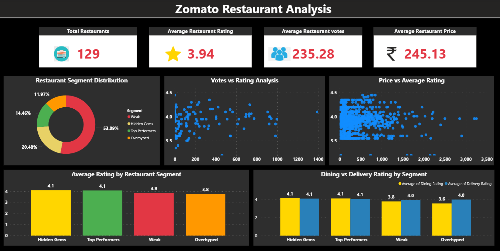
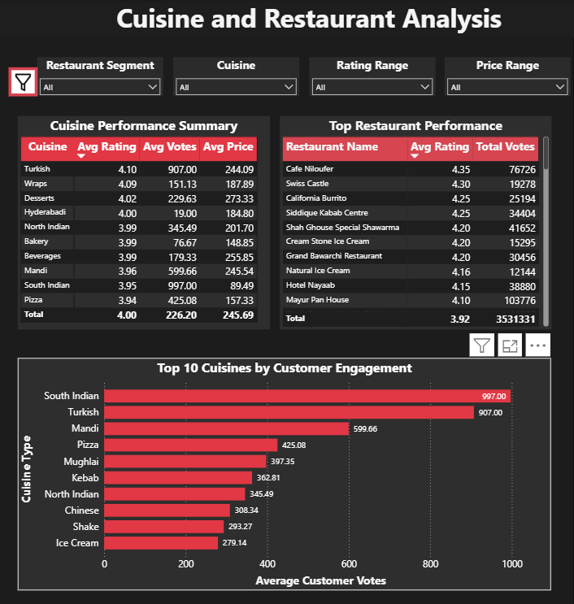

# 🍽️ Zomato Restaurant Analysis & Prediction

## 📌 Introduction

This project analyzes a Hyderabad-based Zomato restaurant dataset to understand restaurant performance patterns using Exploratory Data Analysis (EDA), statistical analysis and machine learning techniques.
### The project focuses on analyzing important restaurant factors such as:
### •	⭐ Average Ratings
### •	🗳 Customer Votes
### •	💰 Pricing Patterns
### •	🍽 Dining Experience
### •	🚚 Delivery Experience
### •	📈 Customer Engagement
### The analysis includes:
### •	🧹 Data Cleaning and Preparation
### •	📊 Exploratory Data Analysis (EDA)
### •	📉 Statistical Testing and Validation
### •	🤖 Machine Learning using Logistic Regression
### •	📊 Interactive Power BI Dashboard Development
### Restaurants were segmented into categories such as:
### •	💎 Hidden Gems
### •	🏆 Top Performers
### •	📢 Overhyped Restaurants
### •	⚠ Weak Restaurants
The project aims to identify restaurant quality patterns, customer engagement behavior and factors influencing restaurant performance while also predicting underperforming restaurants using machine learning techniques.
The insights generated from this project help support better restaurant analysis, recommendation strategies and business decision-making.

---

## 🎯 Project Objective

The main objective of this project is to analyze restaurant performance patterns in Hyderabad using Zomato restaurant data and identify the key factors influencing customer engagement and restaurant quality.
This project aims to:
- 📊 Analyze restaurant behavior using ratings, votes, pricing, dining, and delivery performance
- 🧠 Identify meaningful restaurant segments such as Hidden Gems, Top Performers, Overhyped and Weak restaurants
-	🔍 Discover patterns affecting restaurant popularity and customer satisfaction
-	📉 Perform statistical analysis to validate important business insights
-	🤖 Build a machine learning model to predict underperforming (Weak) restaurants
-	📊 Develop an interactive Power BI dashboard for business storytelling and visualization
The overall goal is to generate actionable insights that help understand restaurant quality, customer engagement behavior and performance trends across different restaurant categories.

---

## 🏦 Business Problem

Food delivery platforms like Zomato host thousands of restaurants, making it difficult for customers to identify high-quality, trustworthy, and value-for-money restaurants.
From a business perspective, the platform also faces challenges such as:
-	Identifying underperforming restaurants that may harm customer experience 
-	Highlighting hidden gems that are highly rated but less popular 
-	Understanding how price, ratings, votes, and cuisine affect restaurant success 
-	Balancing recommendations between popular and quality-based restaurants 
This creates a need for data-driven analysis to better understand restaurant performance patterns and improve recommendation systems.

---

## 📂 Dataset Description

The dataset contains restaurant-level and customer engagement information for Hyderabad restaurants listed on Zomato. The data includes restaurant ratings, pricing, dining and delivery performance, cuisine details, customer votes and popularity indicators.
The dataset was used to analyze restaurant quality, customer engagement behavior, restaurant segmentation and weak restaurant prediction.

## 📌 Key Columns
### Column Name	Description
- restaurant_name	Name of the restaurant
- cuisine	Type of cuisine served
- avg_rating	Overall average restaurant rating
- dining_rating	Dining experience rating
- delivery_rating	Delivery experience rating
- total_votes	Total customer votes receivedu g
- dining_votes	Votes received for dining experience
- delivery_votes	Votes received for delivery experience
- price	Average restaurant pricing
- segment Restaurant category(weak,Hidden Gems,Top Performers,Overhyped)

---

## 🛠 Tools and Libraries Used

### 💻 Programming & Query Languages
-	Python
-	SQL
### 📊 Data Analysis & Visualization
-	Pandas
-	NumPy
-	Matplotlib
-	Seaborn
### 📈 Statistical Analysis
-	SciPy
### 🤖 Machine Learning
•	Scikit-learn
### 📊 Dashboard & Reporting
-	Power BI
### 🧪 Development Environment
-	Jupyter Notebook

---

## 🔄 Project Workflow

### 1. Data Loading
- Dataset loaded using Pandas
- Initial structure and column types explored
  
### 2. SQL Analysis
- Performed KPI analysis such as total restaurants, average rating, votes, and price
- Business queries executed for top restaurants, high-rated restaurants and engagement analysis
  
### 3. Data Cleaning
- Filtered Hyderabad restaurant data
- Handled missing values and duplicates
- Cleaned text columns and standardized formats
- Converted categorical columns
- Validated dataset consistency
  
### 4. Feature Engineering
Created restaurant segmentation feature (Weak, Hidden Gems, Top Performers, Overhyped)

### 5. Exploratory Data Analysis (EDA)
- Descriptive statistics of key variables
- Correlation analysis between rating, price and votes
- Cuisine-wise and segment-wise analysis
- Customer engagement and voting behavior analysis
  
### 6. Data Visualization
- Price vs Rating analysis
- Votes vs Rating analysis
- Segment-wise performance comparison
- Cuisine engagement analysis
- Dining vs Delivery rating comparison
- Segment distribution analysis

### 7. Statistical Analysis
- Paired T-Test (Dining vs Delivery ratings)
- ANOVA Test (Segment-wise rating differences)
- Independent T-Test (Weak vs Non-Weak comparison)
- 
### 8. Machine Learning
- Logistic Regression model for Weak restaurant prediction
- Feature selection and train-test split
- Model evaluation and accuracy measurement
- Actual vs predicted analysis
  
### 9. Power BI Dashboard
- Created interactive 2-page dashboard
- Visualized restaurant performance, cuisine insights, and segment analysis
- Added KPI cards and business insights

---

## 🔍 Key Insights
- The restaurant dataset shows a clear imbalance in segment distribution, with Weak restaurants dominating, followed by Hidden Gems, Top Performers and Overhyped categories, indicating uneven restaurant quality across Hyderabad.
- Ratings remain relatively stable across price ranges, showing a weak relationship between price and average rating, meaning higher price does not guarantee better customer satisfaction. 
- Customer engagement (votes) is mostly concentrated below 1000 votes per restaurant, while ratings remain between 3.5–4.2, indicating that popularity is not strongly correlated with rating quality. 
- Segment-wise analysis shows that Hidden Gems (~4.11) and Top Performers (~4.08) achieve the highest ratings, while Weak (~3.86) and Overhyped (~3.77) perform lower in comparison. 
- Engagement analysis shows that Top Performers and Overhyped restaurants receive higher customer interaction, while Weak restaurants dominate in count but have lower engagement levels. 
- Delivery ratings are slightly more consistent across segments compared to dining ratings, with Overhyped restaurants showing the largest gap between dining and delivery experience, indicating inconsistency in service quality. 
- Cuisine analysis shows that South Indian and Turkish cuisines receive the highest customer engagement, followed by Mandi, Pizza, Mughlai and Kebab cuisines, indicating strong preference for traditional and meal-oriented food categories. 
- Key drivers of restaurant performance include segment classification, customer ratings, votes and cuisine preference, while price has a weaker influence on overall restaurant success. 

---

## 🤖 Machine Learning Insights
-	The model effectively classifies restaurants into Weak vs Non-Weak categories using features such as ratings, votes, and pricing behavior. 
-	The model performs better in identifying Weak restaurants (Recall = 0.79), which aligns with the business goal of detecting underperforming restaurants. 
-	Overall model accuracy is around 69%, indicating reasonable predictive performance for real-world classification use cases. 
-	The confusion matrix shows 2148 correct predictions out of 3123 cases, with misclassifications occurring mainly in borderline cases between Weak and Non-Weak restaurants. 
-	Errors suggest overlapping patterns where restaurant behavior is not clearly separable, indicating natural ambiguity in real-world restaurant performance data.

---

## 💼 Business Impact

-	The primary focus of this analysis is to accurately identify Weak restaurants, which represent underperforming listings with low ratings, low engagement or poor customer feedback. 
-	Detecting Weak restaurants helps the platform improve overall customer experience by: 
  Reducing visibility of poor-quality restaurants 
	Improving ranking algorithms 
	Supporting quality control decisions 
-	At the same time, the model indirectly helps highlight Hidden Gems, which are high-rated but low-engagement restaurants that are often overlooked by users. 
-	By identifying Hidden Gems, the platform can improve recommendation systems and promote better-quality restaurants that deserve more visibility. 
-	Overall, this dual insight (Weak + Hidden Gems) helps create a balanced ecosystem, improving both customer satisfaction and restaurant fairness on the platform.

 --- 

## 📊 Power BI Dashboard

- Created an interactive Power BI dashboard for restaurant performance analysis and customer engagement insights
- Visualized key findings from SQL analysis, Python EDA, statistical analysis.
- Analyzed restaurant segments, cuisine performance, customer engagement patterns, and restaurant quality indicators
- Included KPIs, restaurant performance analysis, cuisine insights.

📌 Dashboard Screenshots: (added in repository)
📌 File: `Zomato_Restaurant_Analysis_Dashboard.pbix`

### Page 1 - Restaurant Perfomance overview 

### Page 2 - Restaurant & Cuisine 

---

## 📌 Key Takeaways
-	Restaurant performance is mainly driven by ratings, votes and cuisine rather than price. 
-	Weak restaurants dominate the dataset, showing need for quality detection. 
-	Hidden Gems exist as high-quality but low-visibility restaurants. 
-	Customer engagement (votes) is not strongly aligned with ratings. 
-	South Indian and Turkish cuisines show higher engagement. 
-	ML model effectively identifies Weak restaurants with reasonable accuracy.

---

## 👤 Author

**Avinash Reddy**

This project is part of my Data Analyst learning journey focused on SQL, Python, statistical analysis, machine learning prediction and Power BI dashboard development to generate business insights from restaurant performance data.

